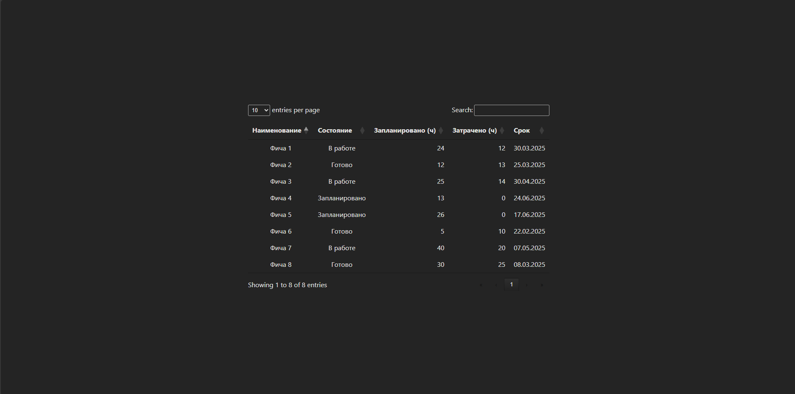

# DIRECTUM_test_practic

> предполагается что все действия происходят из корня проекта

## Запуск приложения

### Установка зависимостей

```cmd
cd ./directum/
npm install
```

### Запуск

```cmd
cd ./directum/
npm run dev
```

**Запускается по адресу [localhost:5173/](localhost:5173/)**

## Вид приложения


